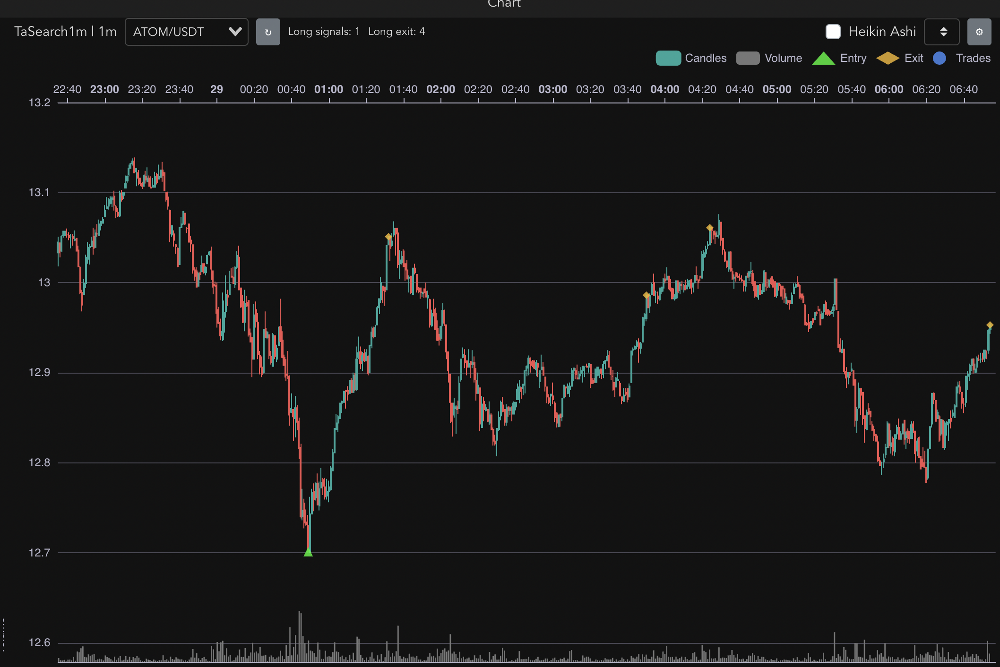

## Description


Entry indicator detection library and strategies for FreqTrade trade bot, see `user_data/strategies` directory.  

```
freqtrade trade --config config.usdt.5m.json --strategy TaSearch5m --db-url sqlite:///search5mStrategy.sqlite
freqtrade trade --config config.usdt.30m.json --strategy TaSearch30m --db-url sqlite:///search30mStrategy.sqlite
```



### Installation

For development copy the repository using git clone and install package requirements with commands below.

```
python -m venv .env
source .env/bin/activate

pip install -r requirements.txt
pip install --force-reinstall -r requirements.txt
```

### Testing

The command to download time series data for an interval
```
python download.py LDO 5m 1666310400 1667210709
python download.py LDO 30m 1666310400 1667210709
```

Run tests
```
python -m pytest test
or 
python -m pytest -s test/user_data/strategies/test_TaSearchLevelG15m.py
python -m pytest -s test/user_data/strategies/test_TaSearchLevelH15m.py
python -m pytest -s test/user_data/strategies/test_TaSearchLevelJ15m.py
```